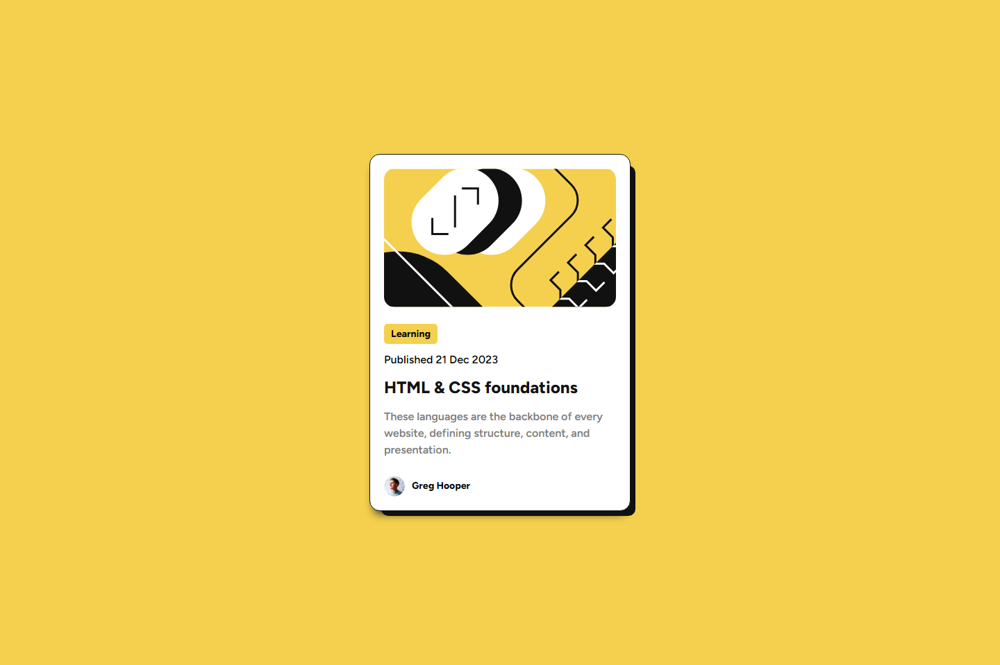

# Frontend Mentor - Blog preview card solution

## Overview

### The challenge

Users should be able to:

- See hover and focus states for all interactive elements on the page

### Screenshot

### Links

- Solution URL: [Link](https://your-solution-url.com)
- Live Site URL: [Link](https://your-live-site-url.com)

## My process

### Built with

- Semantic HTML5 markup
- CSS custom properties
- Flexbox

## Author

- Frontend Mentor - [@Viv](https://www.frontendmentor.io/profile/b-viv)
